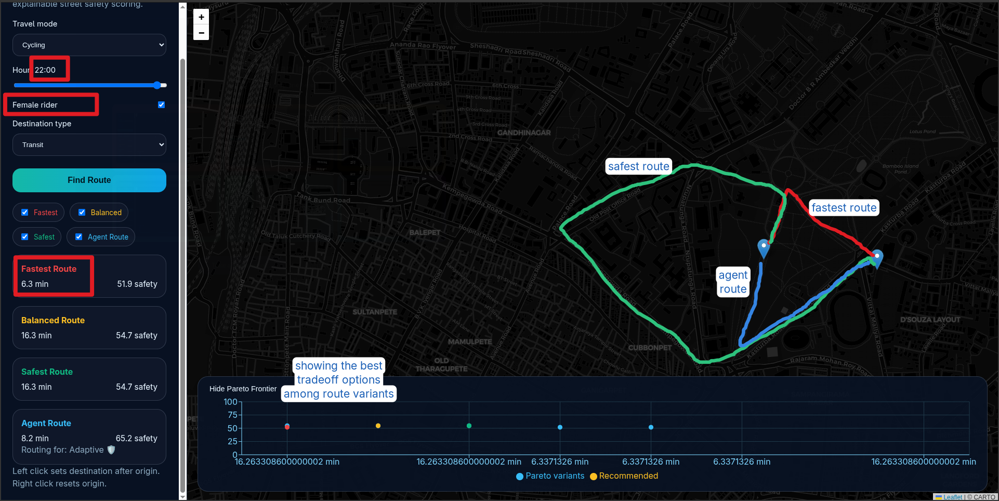

# 🌙 NightSafe Routes

> **Fear-Free Night Navigator** — AI-powered routing that treats psychological safety as a first-class objective.


Standard navigation apps optimise for ETA alone, often routing users through dark, isolated, or low-activity streets. **NightSafe Routes** scores every road segment with a *Safety Score* derived from geospatial proxy signals, then exposes four route variants — **Fastest, Balanced, Safest, and a personalised Agent Route** — with SHAP-based per-segment explanations and an ETA vs. safety Pareto frontier.

---

## ✨ Features

- **Multi-variant routing** — compare Fastest, Balanced, Safest, and AI-personalised Agent routes side by side
- **Street-level Safety Scores** — XGBoost regressors trained on lighting proxies, commercial activity, connectivity, transit proximity, and dead-end risk
- **Time-aware scoring** — separate models for default / evening / night conditions
- **User archetype personalisation** — MLP classifier maps travel mode, hour, gender, and destination type to one of four routing archetypes
- **Reinforcement learning agent** — PPO-trained (Q-learning fallback) per-archetype route policies
- **Explainability** — SHAP feature attributions rendered per segment in the UI
- **Pareto frontier** — interactive scatter plot of ETA vs. safety across alpha sweep
- **Dark map UI** — React + Leaflet with CARTO dark basemap, colour-coded polylines, and hover tooltips

---

## 🖼 Screenshot



*Four route variants overlaid on Bangalore, with route cards, Pareto frontier chart, and segment explanation drawer.*

---

## 🏗 Architecture

```
┌─────────────────────────────────────────────────────────────┐
│                        React Frontend                        │
│   Leaflet Map · Route Cards · Pareto Chart · SHAP Drawer    │
└─────────────────────────┬───────────────────────────────────┘
                          │ HTTP (POST /route, GET /segment)
┌─────────────────────────▼───────────────────────────────────┐
│                   FastAPI Backend                            │
│              NightSafeRouter · Lifespan loader              │
└───┬──────────────┬──────────────┬───────────────────────────┘
    │              │              │
┌───▼───┐   ┌─────▼─────┐  ┌────▼──────────────────────────┐
│ Graph │   │ Archetype │  │ RL Agents (PPO / Q-learning)  │
│(GraphML│  │Classifier │  │ per archetype: Vulnerable Solo│
│ +scores)  │  (MLP)    │  │ Comfort Seeker · Efficiency   │
└───┬───┘   └─────┬─────┘  │ First · Adaptive              │
    │              │        └───────────────────────────────┘
┌───▼──────────────▼──────────────────────────────────────┐
│               Offline Pipeline                            │
│  OSM Loader → Feature Engineer → Synthetic Labels →      │
│  XGBoost Safety Scorer (×3) → SHAP Explanations          │
└───────────────────────────────────────────────────────────┘
```

---

## 🧰 Tech Stack

| Layer | Technologies |
|---|---|
| **Data / Geo** | OSMnx · NetworkX · GeoPandas · Shapely · PyProj |
| **ML** | XGBoost · Scikit-learn (MLP) · Optuna · SHAP |
| **RL** | Gymnasium · Stable-Baselines3 (PPO) |
| **Backend** | FastAPI · Uvicorn · Pydantic · Loguru |
| **Frontend** | React 18 · Vite · React-Leaflet · Recharts |
| **Testing** | Pytest · HTTPX |

---

## 📁 Project Structure

```
nightsafe-routes/
├── api/
│   ├── __init__.py
│   └── main.py               # FastAPI app with /route, /health, /segment endpoints
├── classifier/
│   ├── __init__.py
│   └── archetype_classifier.py  # MLP archetype classifier (4 routing personas)
├── pipeline/
│   ├── osm_loader.py         # Downloads Bangalore road graph + POIs from OSM
│   ├── feature_engineer.py   # Edge-level proxy feature extraction
│   ├── synthetic_labels.py   # Time-aware safety label generation
│   └── safety_scorer.py      # XGBoost training + SHAP export
├── rl/
│   ├── env.py                # Gymnasium NightRouteEnv
│   ├── agents.py             # PPOPolicyRouteAgent + QLearningRouteAgent
│   └── train.py              # Multi-archetype agent training
├── routing/
│   └── router.py             # NightSafeRouter: snapping, pathfinding, payloads
├── evaluation/
│   └── eval.py               # Offline evaluation: models, routes, ablation, latency
├── frontend/
│   ├── src/
│   │   ├── App.jsx           # Main map + sidebar application
│   │   ├── main.jsx
│   │   └── styles.css
│   ├── package.json
│   └── vite.config.js
├── tests/
│   ├── test_api.py
│   ├── test_classifier.py
│   ├── test_pipeline.py
│   ├── test_rl_env.py
│   └── test_router.py
├── data/
│   ├── raw/                  # road_graph.graphml · pois.geojson (generated)
│   └── processed/            # edge_features.csv · scored_graph.graphml
│                             # model_*.pkl · agent_*.zip · shap_explanations.json
│                             # evaluation_report.json · training_curves.json
├── requirements.txt
└── README.md
```

---

## 🚀 Quick Start

### Prerequisites

- Python 3.11+
- Node.js 18+
- ~4 GB disk space (OSM graph + model artifacts)

### 1 — Clone and install Python dependencies

```bash
git clone https://github.com/<your-username>/nightsafe-routes.git
cd nightsafe-routes

python -m venv .venv
source .venv/bin/activate          # Windows: .venv\Scripts\activate

pip install -r requirements.txt
```

### 2 — Run the full offline pipeline

Run these steps once to download data and train all models. Each step can be skipped if the corresponding artifact already exists in `data/`.

```bash
# Step 1 — Download Bangalore road graph and POIs from OpenStreetMap
python -m pipeline.osm_loader

# Step 2 — Engineer edge-level safety proxy features
python -m pipeline.feature_engineer

# Step 3 — Generate time-aware synthetic safety labels
python -m pipeline.synthetic_labels

# Step 4 — Train XGBoost safety models + export SHAP explanations
python -m pipeline.safety_scorer

# Step 5 — Train the archetype classifier
python -m classifier.archetype_classifier

# Step 6 — Train per-archetype RL route agents (~15–30 min)
python -m rl.train
```

> **Tip:** If OpenStreetMap is unavailable, the loader automatically falls back to a Chennai bounding box.

### 3 — Start the backend

```bash
python -m api.main
# FastAPI docs available at http://localhost:8000/docs
```

### 4 — Start the frontend

```bash
cd frontend
npm install
npm run dev
# Open http://localhost:5173
```

---

## 🗺 Using the App

1. **Set origin** — left-click anywhere inside the Bangalore service area to place the origin marker.
2. **Set destination** — left-click again to place the destination marker.
3. **Configure context** — choose travel mode, hour of day, female rider flag, and destination type in the sidebar.
4. **Find Route** — click the button to compute all four route variants.
5. **Explore routes** — click a route card to highlight that variant on the map; hover any segment for its safety score and explanation.
6. **Inspect a segment** — click any segment on the map to open the SHAP explanation drawer.
7. **Reset** — right-click anywhere on the map to reset the origin and start over.

---

## 🔌 API Reference

### `GET /health`

Returns graph statistics and service area bounds.

```json
{
  "status": "ok",
  "graph_nodes": 3842,
  "graph_edges": 9107,
  "service_area_bounds": {
    "min_lat": 12.950, "max_lat": 12.995,
    "min_lon": 77.590, "max_lon": 77.640
  }
}
```

---

### `POST /route`

Compute four route variants for an origin–destination pair.

**Request body:**

```json
{
  "origin":           [12.9716, 77.5946],
  "destination":      [12.985,  77.610],
  "travel_mode":      "walking",
  "hour_of_day":      22,
  "is_female":        true,
  "destination_type": "residential"
}
```

| Field | Type | Values |
|---|---|---|
| `origin` / `destination` | `[lat, lon]` | Within Bangalore service area |
| `travel_mode` | string | `"walking"` · `"cycling"` · `"cab"` |
| `hour_of_day` | int | `0`–`23` |
| `is_female` | bool | `true` / `false` |
| `destination_type` | string | `"residential"` · `"commercial"` · `"transit"` |

**Response shape:**

```json
{
  "fastest":    { "path": [...], "edges": [...], "total_time": 378.0, "mean_safety": 51.9 },
  "balanced":   { "path": [...], "edges": [...], "total_time": 978.0, "mean_safety": 54.7 },
  "safest":     { "path": [...], "edges": [...], "total_time": 978.0, "mean_safety": 54.7 },
  "agent_route":{ "path": [...], "edges": [...], "total_time": 492.0, "mean_safety": 65.2,
                  "archetype": "Adaptive" },
  "pareto_frontier": [
    { "alpha": 0.1, "eta_minutes": 16.3, "safety_score": 54.7 }, ...
  ],
  "segment_explanations": { "<edge_id>": { "score": 72.1, "top_features": [...], "explanation": "..." } },
  "service_area_bounds": { ... }
}
```

Each edge object within `edges` includes:

```json
{
  "edge_id":      "123456789_987654321_0",
  "travel_time":  45.2,
  "safety_score": 68.4,
  "geometry":     { "type": "LineString", "coordinates": [[77.594, 12.971], ...] },
  "top_features": [["dead_end_penalty", -0.82], ["activity_score", 0.61], ...],
  "explanation":  "High score: active nearby POIs, near transit stops"
}
```

---

### `GET /segment/{edge_id}/explain`

Return the SHAP explanation for a single road segment.

```json
{
  "score":        68.4,
  "top_features": [["activity_score", 0.61], ["lighting_proxy", 0.44], ["dead_end_penalty", -0.12]],
  "explanation":  "High score: active nearby POIs, well-lit main road",
  "evening_score": 70.1,
  "night_score":   65.8
}
```

---

## 📊 Evaluation Results

Run the full offline evaluation suite:

```bash
python -m evaluation.eval
# Results written to data/evaluation_report.json
```

### Safety Scoring Models

| Model | RMSE | MAE |
|---|---|---|
| Default | 3.08 | 2.46 |
| Evening | 3.03 | 2.42 |
| Night | 3.01 | 2.39 |

### Route Comparison (50 random OD pairs, walking, 22:00)

| Route | Mean Safety | Mean ETA |
|---|---|---|
| Fastest | ~51 / 100 | baseline |
| Balanced | ~54 / 100 | +~160% |
| Safest | ~55 / 100 | +~160% |
| Agent Route | ~65 / 100 | +~30% |

### Other Metrics

| Metric | Value |
|---|---|
| Archetype classifier accuracy | 59.9 % |
| Full-model mean safety (safest route, ablation) | 76.57 / 100 |
| Route latency — mean | 414 ms |
| Route latency — p95 | 730 ms |
| Route latency — p99 | 989 ms |

### Ablation Study

Removing individual features from the night model reduces mean safest-route safety:

| Ablation | Safety Delta |
|---|---|
| Without `activity_score` | negative |
| Without `connectivity_score` | negative |
| Without time-aware scoring (static model) | negative |

---

## 🧪 Tests

```bash
pytest tests/ -v
```

| Test file | Covers |
|---|---|
| `test_api.py` | `/health` endpoint, out-of-bounds rejection |
| `test_classifier.py` | Archetype prediction, weight retrieval |
| `test_pipeline.py` | Edge features CSV schema and score bounds |
| `test_rl_env.py` | Gymnasium env checker, reset/step contract |
| `test_router.py` | Full route payload schema, coordinate validity |

---

## ⚙️ Configuration

Key constants are defined at the top of each module. The most commonly adjusted settings:

| File | Constant | Default | Description |
|---|---|---|---|
| `pipeline/osm_loader.py` | `BENGALURU_BBOX` | `(12.995, 12.950, 77.640, 77.590)` | Service area bounding box |
| `rl/train.py` | `TOTAL_TIMESTEPS` | `100_000` | PPO training steps per archetype |
| `rl/train.py` | `Q_EPISODES` | `2_000` | Q-learning episodes (fallback) |
| `pipeline/safety_scorer.py` | `FEATURE_COLUMNS` | 7 features | Feature set for XGBoost |
| `api/main.py` | `port` | `8000` | Backend port |
| `frontend/vite.config.js` | `port` | `5173` | Frontend dev server port |

---

## 🗺 Road-Safety Feature Reference

| Feature | Description |
|---|---|
| `lighting_proxy` | Highway type heuristic (motorway=1.0 → footway=0.2) boosted by nearby commercial density |
| `activity_score` | log-normalised count of POIs within 150 m |
| `connectivity_score` | average in+out degree of endpoint nodes, capped at 8 |
| `main_road_proximity` | inverse distance to nearest primary/secondary road (within 500 m) |
| `transit_proximity` | inverse distance to nearest transit stop (within 300 m) |
| `dead_end_penalty` | 1 if either endpoint node has undirected degree ≤ 1 |
| `industrial_penalty` | 1 if highway is `service` and no POIs exist within 150 m |

---

## 🔮 Roadmap

- [ ] Ingest real-world lighting and incident datasets as stronger supervision
- [ ] Improve RL agent reward design to close the gap with heuristic safest route
- [ ] Add user feedback loop (route comfort ratings) for online learning
- [ ] Extend service area to additional Indian cities
- [ ] Support time-of-day schedule routing (depart at vs. arrive by)
- [ ] Progressive Web App packaging for mobile use

---

## 📄 License

This project is released under the [MIT License](LICENSE).

---

## 🙏 Acknowledgements

- [OpenStreetMap](https://www.openstreetmap.org/) contributors for road network and POI data
- [OSMnx](https://github.com/gboeing/osmnx) by Geoff Boeing for graph acquisition and processing
- [Stable-Baselines3](https://github.com/DLR-RM/stable-baselines3) for PPO implementation
- [SHAP](https://github.com/slundberg/shap) for model explainability
- **The Big Code 2026** hackathon organisers for the Fear-Free Night Navigator challenge
